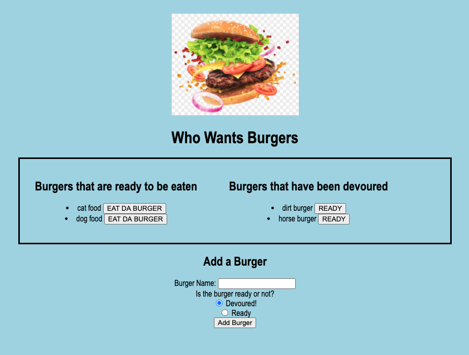

# Eat_Da_Burger 

Welcome to the Eat Da Burger app.  I didn't come up with the name.

This is where the deployed app is located:

https://eat-da-b-urger.herokuapp.com/

Users type in a name of a burger--any name for any burger--and violin, it's displayed on one side.  You can move it to the other side by clicking the button next to the name.  It make not look like much, but it's got it where it counts, kid.  This might look like a simple lame-brained toy, but it's actually a full-stack application using handlebars, databases, etc.  When you add a name of a common or ridiculous sandwich, it's added to a back-end database, there forever.  Make it count.

Here's what it looks like:

112007LOCT2020

Uploaded/launched/deployed Heroku app:

https://eat-da-b-urger.herokuapp.com/

111923LOCT2020

Uploaded final files.  About to post to Hiroku.  Is that how it's spelled?

111225LOCT2020

Finally got most of the Javascript to work; can't seem to make it add a new burger to either column.  It will only add to the 'ready' column.

091218LOCT2020

Submitting more data for the project.  Everything works, can't seem to make the JS work.

071105LOCT2020

Initial Repo set up.  Next is the upload.  And why not?
